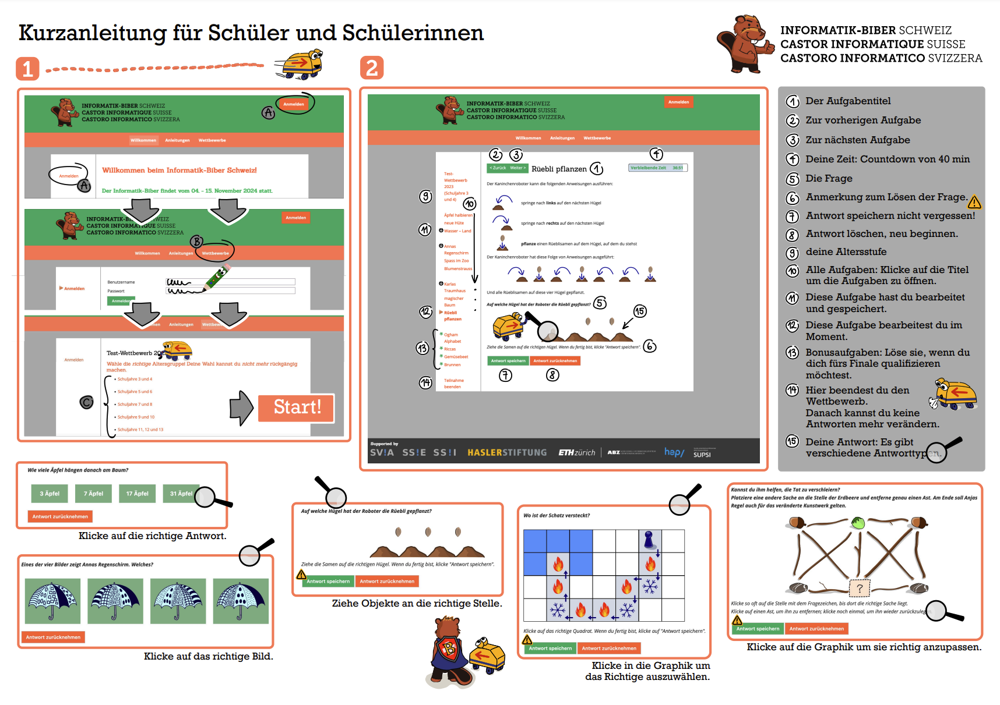

import Restricted from '@tdev-components/documents/Restricted';
import DefinitionList from "@tdev-components/DefinitionList";
import CmsText from '@tdev-components/documents/CmsText';
import WithCmsText from '@tdev-components/documents/CmsText/WithCmsText'

# Informatik-Biber 2025 🦫

Datum 📅
: Einzellektion
: (gemäss Terminplan)
Zeitrahmen ⏱️
: 5 Minuten Vorbereitungszeit
: 40 Minuten Zeit für den Wettbewerb
Bewertung ✔
: wird **nicht** mit einer Note bewertet
Ziel 🎯
: sich herausfordern
: sich mit spannenden, besonderen Informatik-Fragen auseinandersetzen

<Restricted id='39f37914-20f0-4736-9b4f-c68c1d8f1d4a'>
  ## Vorbereitung am Wettbewerbstag
  Für die Durchführung des Wettbewerbs haben Sie **40 Minuten** Zeit. Die Vorbereitung zu Beginn der Lektion muss also möglichst zügig ablaufen, damit Sie rechtzeitig in die Pause gehen können.
  1. Direkt beim Betreten des Klassenzimmers bei der Lehrperson das Login-Kärtchen abholen
  2. Zimmer einrichten wie für eine Probe (Tische in Reihen anordnen)
  3. Laptop einschalten und diese Seite öffnen, auf der Sie sich jetzt gerade befinden

  ## Übungstest
  1. Den obigen Abschnitt [Vorbereitung am Wettbewerbstag](#vorbereitung-am-wettbewerbstag) vollständig durchlesen
  2. Folgende Seiten vollständig durchlesen:
     1. [Aufgaben bearbeiten (1)](https://www.informatik-biber.ch/support/deu/manual_sus/aufgaben-bearbeiten-kurzanleitung/)
     2. [Aufgaben bearbeiten (2)](https://www.informatik-biber.ch/support/deu/manual_sus/aufgaben-bearbeiten-was-du-noch-wissen-musst/)
     3. [Punktvergabe](https://www.informatik-biber.ch/support/deu/manual_sus/punktvergabe/)
  3. Beim [Test-Wettbewerb](https://wettbewerb.informatik-biber.ch/index.php?action=anon_join&grp_id=483) so viele Fragen wie möglich beantworten
</Restricted>

<Restricted id='79023f3c-c6a3-4a3e-9368-dfb69437978b'>
  ## Wettbewerb
  <WithCmsText entries={{
      'username': 'f5768df0-fba4-43f2-8ad8-c38db81db843',
      'password': '38f414b5-af39-44e3-9d1b-597491eec221'}}>
    <DefinitionList>
      <dt>Username</dt>
      <dd><CmsText name='username'/></dd>
      <dt>Passwort</dt>
      <dd><CmsText name='password'/></dd>
    </DefinitionList>
  </WithCmsText>

  1. [https://wettbewerb.informatik-biber.ch/](https://wettbewerb.informatik-biber.ch/) öffnen
  2. Mit den obigen Zugangsdaten einloggen
  3. Altersgruppe auswählen (es sollte nur eine Option geben)
  4. Auf __Start__ klicken (**keine:n Team-Partner:in anmelden**)
  5. Nochmal auf __Start__ klicken
  6. So viele Fragen wie möglich bearbeiten (siehe [Kurzanleitung](#kurzanleitung) unten)

  Viel Spass und viel Erfolg! 🍀🥳
</Restricted>

# Kurzanleitung

---