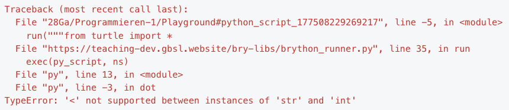

---
sidebar_custom_props:
  id: 975c2237-7335-428d-96db-2e7f507c1d31
page_id: 975c2237-7335-428d-96db-2e7f507c1d31
---

import DefinitionList from "@tdev-components/DefinitionList";

# Bugs 🪲

Beim Programmieren passieren Fehler. Programmfehler nennt man auch **Bugs**.

Es gibt zwei Arten von Programmfehlern:

Syntaxfehler
: Das Programm ist für den Computer unverständlich und nicht ausführbar.
: **Problem:** Wir sagen es falsch.
: **Lösung:** Fehlermeldung genau analysieren.
Logikfehler (Semantikfehler)
: Das Programm ist für den Computer verständlich und wird ausgeführt, macht aber nicht das, was es soll.
: **Problem:** Wir sagen das Falsche.
: **Lösung:** Code genau analysieren (hier gibt es keine Fehlermeldung).


## Syntax Fehler <span className="badge badge--danger">SyntaxError</span>

Sie haben bereits festgestellt, dass Python sehr pingelig ist was Tippfehler und die präzise Verwendung von Klammern, Anführungszeichen, Doppelpunkten und Leerzeichen angeht. Jede Sprache hat seine **eigenen Regeln**, wie Wörter und Sätze strukturiert sein müssen. Diese Regeln sind allgemein bekannt als die **Syntax** einer Sprache. 

Syntax
: Bei **Programmiersprachen** wird mit der Syntax festgelegt, welche Wörter, in welcher Reihenfolge und in welchem Kontext erlaubt sind.


Syntax Fehler sind kleine Fehler in einem Programm. Da das Programm nicht von einem Menschen, sondern von einem Computer "gelesen" und interpretiert wird, reicht ein Tippfehler, ein fehlendes Komma oder eine fehlende Klammer, dass das Programm vom Computer nicht mehr verstanden werden kann.

Die Python Sprache setzt sich aus folgenden Elementen zusammen:

Schlüsselwörter
: oder __Statements__
: Wörter oder Zeichen, die ohne Anführungszeichen und ohne Klammern geschrieben werden.
: z.B. `import`, `from` oder `for`, aber auch `:` oder `*`. 
: Sie müssen in einer vordefinierten Reihenfolge vorliegen, damit diese von Python verstanden werden. *([alle Schlüsselwörter](/python-keywords))*
Befehle
: oder __Unterprogramme__, __Funktionen__
: vordefinierte Befehle, die mit einer runden Klammer aufgerufen werden.
: z.B. `print('hello')`
Variablen
: Namen, die einen Wert enthalten

:::warning[Häufigste Ursachen]
- Fehler bei **Schlüsselwörtern**
- vergessene oder falsch eingesetzte **Feldtrenner** (z.B. `:`)
- Falsche Anordnung von Schlüsselwörtern/Feldtrennern
:::

### Beispiele

:::flex{min=250px}
```py live_py slim
frm turtle import *
forward(100)
```
::br
```py live_py slim
from turtle import *
goto(100 50)
```
::br
```py live_py slim
from turtle import *
for i in range(4)
    forward(25)
    right(90)
```
::br{.empty}
:::

:::::aufgabe[Fehler finden]
<Answer type="state" id="02a77086-17d0-4045-90dd-b47286b7110d" />

Untersuchen Sie obenstehende Programmschnipsel. Was sagen Ihnen die Fehlermeldungen?

- Auf welcher Zeile der Fehlermeldung steht die Art des Fehlers?
    <Answer type="text" id="3b9aa96c-57b7-436d-88f8-6ef642a9569a" />
- Wo in der Fehlermeldung finden Sie Hinweise auf den Fehler? Flicken Sie sie...

::::flex{min=250px}
```py live_py title=error1.py id=6cdb7162-bc67-4b3b-8879-93cef97a10a5
frm turtle import *
forward(100)
```
::br
```py live_py title=error2.py id=d3d13806-be6e-4043-8375-8208989328fc
from turtle import *
goto(100 50)
```

:::finding[Hinweis]
Was macht der Befehl `goto`? Schauen Sie die Funktionsweise unter [Turtle Befehle#goto(x, y)](../20-commands/index.mdx#gotox-y) nach
:::

::br
```py live_py title=error3.py id=8f6d207b-397a-4c54-9812-f49956ccfef8
from turtle import *
for i in range(4)
    forward(25)
    right(90)
```
::br{.empty}
::::
<Solution id="1f388fb6-ca43-482b-b807-91dabd755c97">

Die Fehlermeldung gibt den Hinweis, was falsch ist. Meist steht der wichtigste Hinweis in den letzten Zeilen. 

**error1.py**:
- Zeile 1: Tippfehler, `from`

**error2.py**:
- Zeile 2: Vergessenes Komma bei `goto(100, 50)`

**error3.py**:
- Zeile 2: Vergessenes `:` am Ende der Zeile

</Solution>

:::::

## Namens Fehler <span className="badge badge--danger">NameError</span>

Tippfehler beim Aufrufen von Unterprogrammen oder bei der Verwendung von Variablen führen oft zu einem Namens-Fehler (`NameError`). Es wird also versucht, ein Unterprogramm zu öffnen (oder eine Variable abzufragen), das aber **unter diesem Namen nicht gefunden** werden kann.

:::warning[Häufigste Ursachen]
Die häufigste Ursachen von `NameError`s sind
- Vertipper im Namen des Befehls
- nicht `importierte` Befehle (z.B. `from turtle import *` fehlt)
:::

### Beispiele
```py live_py slim
from turtle import *
forwrd(100)
```

Der angegebene Befehl `forwrd` kann nicht gefunden werden, da er weder in einer importierten Bibliothek, noch im aktuellen Programm gefunden werden kann.

Der gleiche Fehler tritt auf, wenn der Befehl zwar richtig geschrieben wird, das Importieren aber vergessen geht:

```py live_py slim
forward(100)
```

::::aufgabe[Fehler finden]
<Answer type="state" id="4752b4a9-6a92-49fc-8641-40fa210f6113" />

Finden und lösen Sie die entstandenen Fehler. Flicken Sie alle Fehler, indem Sie die Fehlermeldungen analysieren.

:::warning
Die verwendeten Befehle haben wir bisher **nicht** angeschaut. Dennoch können die Fehler durch die Fehlermeldungen gefunden und behoben werden.
:::

```py live_py title=error.py id=2ec619fd-b01e-431c-84d2-227c5da79f6e
from math import *

print('15.3 gerundet =', rond(15.3))
print('15.8 gerundet =', round(15.8))
print('15.3 aufgerundet =', ceyl(15.3))
print('15.8 abgerundet =', flor(15.8))
```

Nachdem das Programm nun geflickt ist... was machen die Befehle?

<Answer type="text" id="dbeed1da-23e3-4b6a-8988-fe6ce4607f1e" />

<Solution id="091be86e-ca29-4a0d-8282-468430553214">

Drei Namensfehler, die Fehlermeldung sagt die Zeilennummer und schlägt den richtigen Befehl vor:

<DefinitionList gridTemplateColumns="minmax(2em, 1fr) minmax(4em, 8fr)">
<dt>Z. 3</dt>
<dd>
    ```error
    File "error_py", line 3, in <module>
    NameError: name 'rond' is not defined
    ```
</dd>
<dt>Z. 5</dt>
<dd>
    ```error
    File "error_py", line 5, in <module>
    NameError: name 'ceyl' is not defined. Did you mean: 'ceil'?
    ```
</dd>
<dt>Z. 6</dt>
<dd>
    ```error
    File "error_py", line 6, in <module>
    NameError: name 'flor' is not defined. Did you mean: 'floor'?
    ```
</dd>
</DefinitionList>
</Solution>
::::


## Einrückungsfehler <span className="badge badge--danger">IndentationError</span>

Python erwartet nach jedem Doppelpunkt `:`, dass ein **eingerückter** Codeblock kommt. Falls kein eingerückter Codeblock gefunden wird, entsteht ein `IndentationError`. Wird jedoch fälschlicherweise eine Zeile eingerückt, so wird ebenfalls dieser Fehler angezeigt.

:::warning[Häufigste Ursachen]
- Die nächste Zeile nach einem Doppelunkt `:` ist nicht eingerückt
- Eine Zeile ist fälschlicherweise eingerückt
- ein Leerschlag zu wenig eingerückt
:::

:::tip[Einrücken mit der Tabulator-Taste]
Am einfachsten kann Code mit der :mdi[keyboard-tab] Tabulator-Taste eingerückt werden. Es kann auch ein Code-Block markiert und mit :mdi[keyboard-tab] eingerückt werden.
:::

### Beispiel

:::cards{min-width=250px}
::br{backgroundColor=var(--ifm-color-danger-lightest)}
**Nicht eingerückt**
```py live_py slim
for i in range(5):
print('Hallo')
```
::br{backgroundColor=var(--ifm-color-success-lightest)}
**Korrektur**
```py live_py slim
for i in range(5):
    print('Hallo')
```
:::

:::cards{min-width=250px}
::br{backgroundColor=var(--ifm-color-danger-lightest)}
**Falsch eingerückt**
```py live_py slim
print('Hallo')
 print('wie')
print('gehts?')
```
::br{backgroundColor=var(--ifm-color-success-lightest)}
**Korrektur**
```py live_py slim
print('Hallo')
print('wie')
print('gehts?')
```
:::

:::aufgabe[Fehler finden]
<Answer type="state" id="d5fc6d3b-9e28-4c82-af59-c5465efe87cb" />

Finden und lösen Sie die entstandenen Fehler, so dass die Ausgabe
```sh
Hallo zum 0
Hallo zum 1
Ende
```
lautet. Das Programm muss also immer wieder ausgeführt-, die Fehlermeldungen analysiert und Codeteile korrigiert werden.

```py live_py title=errors.py id=0538f258-5b10-4dec-be08-644e1f1df6a8
for i in range(2):
print('Hallo zum', i)
 print('Ende')
```
<Solution id="21021b9f-4415-489a-8b2c-470ff19440c2">

```py live_py slim
for i in range(2):
    print('Hallo zum', i)
print('Ende')
```
</Solution>
:::

## Typfehler <span className="badge badge--danger">TypeError</span>

Typfehler entstehen, wenn ein Befehl mit einem **falschen Datentyp** aufgerufen wird. Die meisten Python Befehle erwarten einen bestimmten Datentyp als Argument. Zum Beispiel erwartet der Befehl `forward` eine ganze Zahl vom Typ `int`.
Wird ein falscher Datentyp übergeben, so kann der Befehl nicht ausgeführt werden und es entsteht ein `TypeError`.

::::aufgabe[Error 1]
<TaskState id='13a0c8b9-b42d-40d0-8d46-3048eccdecd7' />

Beim Ausführen eines Programms stossen Sie auf folgende Fehlermeldung:



Was könnte hier das Problem sein?

:::tip[Tipps]
- Um welchen Turtle-Befehl handelt es sich hier wohl?
- Welche Datentypen haben Sie bereits kennengelernt?
:::

Halten Sie Ihre Vermutung hier fest:

<QuillV2 id='05f77c5e-3743-4b2c-b923-2eab682bffbb' />

<Solution id='52e42c14-e0a9-4775-a409-32bea999e0e3'>
  Es scheint, als hätte hier jemand den Befehl `dot(d)` mit einem `str` statt mit einem `int` aufgerufen. Vielleicht wurde also so etwas geschrieben wie `dot('40')` statt `dot(40)`.
  <br/>
  Die entsprechenden Hinweise finden Sie auf den letzten beiden Zeilen der Fehlermeldung.
</Solution>
::::


::::aufgabe[Error 2]
<TaskState id='8aa4ce22-5fe8-4d0e-b5a6-43eb46072e34' />

Auch in diesem Programm hat sich wieder ein Bug eingeschlichen. Eigentlich sollte hier die UK-Flagge gezeichnet werden, aber das Programm lässt sich momentan nicht ausführen.

Starten Sie das Programm, analysieren Sie die Fehlermeldung und beheben Sie den Fehler. Das Programm sollte danach mindestens ausführbar sein.

:::tip[Dokumentation]
Die korrekte Verwendung aller Turtle-Befehle ist im [Cheatsheet](../Cheatsheet-Turtle-Befehle) dokumentiert.
:::

```py live_py id=9fd5b5c8-8c35-4de6-9a94-6f5fe5a40bb9
from turtle import *

speed(0)
bgcolor('#012169')

penup()
goto(-300, 150)
pendown()
color('white')
pensize(30)
goto(300, -150)

penup()
goto(-300, -150)
pendown()
goto(300, 150)

penup()
goto(-300, 150)
pendown()
color('#C8102E')
pensize(10)
goto(300, -150)

penup()
goto(-300, -150)
pendown()
goto(300, 150)

penup()
goto(0, 150, 0)
pendown()
color('white')
pensize(50)
right(90)
forward(300)

penup()
goto(-300, 0)
pendown()
left(90)
forward(600)

penup()
goto(0, 150)
pendown()
color('#C8102E')
pensize(30)
right(90)
forward(300)

penup()
goto(-300, 0)
pendown()
left(90)
forward(600)

hideturtle()
done()
```

<Solution id='98bd2d38-73a9-43a4-8603-1ae3726f4886'>
  Der `goto(x, y)`-Befehl auf Zeile 31 hat ein Argument zu viel. Wenn das dritte Argument (also das zusätzliche `, 0`) entfernt wird, dann läuft das Programm fehlerfrei.
</Solution>
::::


## Logikfehler

Aus der Sicht von Python funktioniert alles und das Programm kann ausgeführt werden 👍🥳.

Sobald aber das Programm ausgeführt wird, macht es nicht das, was Sie sich gewünscht haben - dann spricht man von Logik-Fehlern 💩...

Diese Fehler sind im allgemeinen **am schwierigsten zu finden**. Ein häufiger Fehler ist aber, dass man bei einem Befehl die runden Klammern am Ende vergisst - für Python kein Problem, da es den Befehl kennt, jedoch nicht dazu aufgefordert wird, diesen auszuführen. (Der Befehl wird also nicht **aufgerufen**.)

:::warning[Häufigste Ursachen]
Checkliste für Logikfehler
- sind bei Befehlen die runden Klammern `()` am Ende angegeben?
- bis zu welchem Punkt funktioniert das Programm? (Fehler eingrenzen)
- ...
:::

### Beispiel

```py live_py slim
from turtle import *
penup()
goto(-10, 10)
pendown
for i in range(4):
    forward(20)
    left(90)
```
Auf Zeile 4 fehlen die runden Klammern - `pendown` wird nicht ausgeführt! Fehler beheben: Den Befehl mit `pendown()` aufrufen.


---

::::aufgabe[Fehler finden]
<Answer type="state" id="9fbdda43-73ca-43a1-9e51-ee20414b819b" />

Finden und beheben Sie alle Fehler, so dass folgende Ausgabe entsteht:


:::warning[Iteratives Vorgehen]
Ein **iteratives Vorgehen** ist hier unumgänglich. Überprüfen Sie nach jeder Korrektur, ob Sie den aktuellen Fehler beheben konnten, oder ob noch weitere Fehler vorliegen.
:::

```py live_py title=errors.py id=b11d905a-08e3-4f43-810f-c4c227bb5d46
from turtle import *

fillcolor("Rot")
 penup()
goto(-125 125)
begin_fill()
for i in range(4)
    forward(250)
    left(90)
end_fill()
forward(150)
links(90)
forward(50)
fillcolor("white")
begin_fill()
for i in range(4):
    forward(50)
    right(90)
    forward(50)
    left(90)
    forward(50)
    left(90)
end_fill


```
<Solution id="6dfef9ff-120c-4950-8d48-f30effcb2d3f">

**Vorgehensweise**:
1. Programm ausführen
2. Fehlermeldung analysieren und **nur** diesen Fehler flicken
3. Zurück zu Punkt 1

```py live_py slim
from turtle import *

penup()
goto(-125, -125)
fillcolor("red")

begin_fill()
for i in range(4):
    forward(250)
    left(90)
end_fill()
forward(150)
left(90)
forward(50)
fillcolor("white")
begin_fill()
for i in range(4):
    forward(50)
    right(90)
    forward(50)
    left(90)
    forward(50)
    left(90)
end_fill()
```
</Solution>

::::
