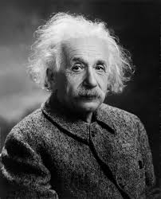

import Steps from '@tdev-components/Steps'

# Textverarbeitung & Style
In dieser Unterrichtseinheit lernen Sie, wie Sie mit Microsoft Word Texte formatieren und gestalten können.

# Informationen zur Probe

Modus
: am Computer
Hifsmittel
: für den praktischen Teil darf nur Microsoft Word verwendet werden
: andere Webseiten / Hilfsmittel sind nicht erlaubt
Dauer
: ca. 15 Minuten
Aufträge
: in einem max. 10-minütigen Video (Screencast) formatieren Sie einen vorgegebenen Text nach bestimmten Kriterien
Inhalt
: Alle Module in diesem Themenblock sind Teil der Probe.
Gewichtung der Note
: 1/2 

# Lernziele

* Sie können ein Word-Dokument erstellen und speichern.
* Sie können Texte in Word erstellen, bearbeiten sowie kopieren und einfügen.
* Sie können Schriftart, Schriftgrösse, Farbe, Absatz-, Zeilen- und Seitenlayout sowie andere gewünschte Formatierungen anpassen.
* Sie können Aufzählungen und Nummerierungen erstellen, formatieren und bearbeiten.
* Sie können die Dokumentansicht an ihre Bedürfnisse anpassen.
* Sie können die Anzahl Wörter und Zeichen eines Dokuments ermitteln.
* Sie können Begriffe im gesamten Dokument suchen und ersetzen.
* Sie können Formatvorlagen zuweisen, anpassen und aktualisieren.
* Sie können Formatvorlagensätze und Designs anwenden.
* Sie können verschiedene Formatierungen über Formatvorlagen anpassen.
* Sie können Absätze und Zeilenwechsel korrekt einfügen.
* Sie können Seitenumbrüche an einer gewünschten Stelle einfügen.
* Sie können Formatierungszeichen in Word ein- und ausblenden.
* Sie können die wichtigsten Formatierungszeichen erkennen und unterscheiden.
* Sie können Text linksbündig, zentriert, rechtsbündig oder im Blocksatz ausrichten.
* Sie können die automatische Worttrennung in Word aktivieren und deaktivieren.
* Sie können ein automatisches Inhaltsverzeichnis einfügen und aktualisieren.
* Sie können Überschriften mithilfe von Formatvorlagen im Inhaltsverzeichnis darstellen.
* Sie können Fussnoten in ein Dokument einfügen.
* Sie können Kopf- und Fusszeilen bearbeiten und Inhalte mithilfe von Tabulatoren links, zentriert oder rechts ausrichten.
* Sie können Kopf- und Fusszeilen auf bestimmten Seiten unterschiedlich anzeigen und formatieren.
* Sie können Bilder in ein Word-Dokument einfügen.
* Sie können den Textumbruch und die Grösse von Bildern anpassen.
* Sie können Bilder mit einer Beschriftung versehen, gruppieren und im Dokument positionieren.
* Sie können ein Word-Dokument als PDF exportieren.
* Sie können Hyperlinks zu Webseiten erstellen.
* Sie können Links zu Stellen innerhalb eines Dokuments erstellen.
* Sie können E-Mail-Adressen als Hyperlink einfügen.
* Sie können Quellen für Bücher, Webseiten und Bilder korrekt in Word erfassen.
* Sie können Quellen nach einem vorgegebenen Zitierstil zitieren.
* Sie können die Bedeutung von Quellenangaben und Zitierstilen erklären.
* Sie können ein automatisches Literaturverzeichnis erstellen und aktualisieren.
* Sie können zwischen urheberrechtlich geschützten und frei lizenzierten Werken unterscheiden.

# Beispielprobe

Sie dürfen die Schritte – ausser den ersten und den letzten drei Schritte – in beliebiger Reihenfolge ausführen. Die untenstehende Reihenfolge wird jedoch empfohlen, da sie bereits optimiert ist.

Hinweis: Dies ist lediglich eine Beispielprobe. In der echten Probe können andere Aufgaben vorkommen. Ausserdem wird die echte Probe leicht kürzer sein. 

[Ausgangsdokument](https://erzbe-my.sharepoint.com/:w:/g/personal/friederike_metz_gbsl_ch/IQBiDDG7NbX9RYtnSerB-w7-AaQ__Nblzv9YF4ubOEq75Tw?e=hH6Cts) bitte herunterladen und in Microsoft Word öffnen.

Ziel: Innerhalb von **12 Minuten** sollen die nächsten Schritte ausgeführt werden:

1. Starten Sie einen **Screencast** des gesamten Bildschirms.
2. Verwenden Sie für die folgenden Schritte ausschliesslich **Formatvorlagen**.
    - a) Ändern Sie die Schriftart und Schriftgrösse des gesamten Dokuments auf **Calibri 10.5 Pt.**
    - b) Stellen Sie **den Absatzabstand** im gesamten Dokument auf **2 Pt** ein.
    - c) Richten Sie den gesamten Text im **Blocksatz** aus.
    - d) Formatieren Sie den **Titel** mit **24 Pt**, **fett** und **zentriert**.
    - e) Formatieren Sie die **Kapitelüberschriften** mit **18 Pt**, **grün** und **fett**.
    - f) Formatieren Sie die **Unterkapitelüberschriften** mit **14 Pt**, **grün** und **unterstrichen**.
    - g) Nummerieren Sie alle Kapitel und Unterkapitel automatisch (z. B. 1, 2, 2.1, 2.2 …).
3. Fügen Sie unterhalb des Titels ein **Inhaltsverzeichnis** ein, das alle Kapitel und Unterkapitel enthält.
4. Fügen Sie nach dem Inhaltsverzeichnis einen **Seitenumbruch** ein, sodass das erste Kapitel auf der nächsten Seite beginnt.
5. Fügen Sie nach dem ersten Satz eine **Fussnote** mit folgendem Text ein:
    „Ich bin eine Fussnote.“
6. Erstellen Sie eine **Fusszeile** mit Ihrem Namen linksbündig und der Seitenzahl rechtsbündig.
7. Suchen Sie nach dem Wort „Liste“. Stellen Sie die nachfolgenden Obstsorten als **Aufzählung** mit schwarzen quadratischen Aufzählungszeichen dar.
8. **Ersetzen** Sie im gesamten Dokument das Wort „dolores“ durch „Schmerzen“.
9. Fügen Sie das untenstehende **Bild** in das Word-Dokument ein. Passen Sie die Grösse sinnvoll an. Der Text soll um das Bild **herumfliessen**.
10. Fügen Sie unterhalb des Bildes eine zentrierte **Beschriftung** mit dem Text „Albert Einstein“ ein.
11. **Gruppieren** Sie Bild und Beschriftung und platzieren Sie beides gemeinsam auf der zweiten Seite.
12. Am Ende des Dokuments befindet sich ein **Link**. Verknüpfen Sie das letzte Wort „diam“ mit diesem Link und löschen Sie anschliessend den ursprünglichen Link.
13. Am Ende des vorletzten Absatzes befindet sich ein **Zitat** aus Dürrenmatts „Die Physiker“. Erfassen Sie die Quelle in Word und fügen Sie am Ende des Dokuments ein **Literaturverzeichnis** ein. Löschen Sie die ursprüngliche Quelle.
14. **Aktualisieren** Sie das gesamte Inhaltsverzeichnis.
15. Schreiben Sie ans Ende des Dokuments die Anzahl **Zeichen ohne Leerzeichen**.
16. Speichern Sie das Word-Dokument.
17. Exportieren Sie das Word-Dokument als **PDF**.
18. Beenden Sie den Screencast.
19. Nur während der echten Probe: Senden Sie das **Word-Dokument**, das **PDF** und den **Screencast** über Teams an Frau Metz.

Das fertige Dokument sollte in etwa so aussehen: [PDF](https://erzbe-my.sharepoint.com/:b:/g/personal/friederike_metz_gbsl_ch/IQAgTWP-hezyQqN6T5hM_lf_AYI4jj4k_foFL8RHmosl190?e=3Pq1oR)

---